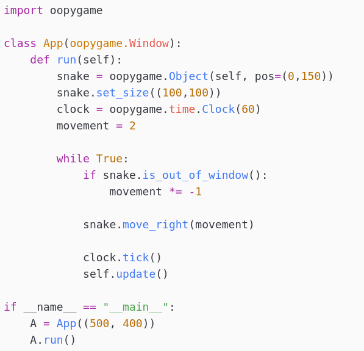

<p align="center">
  
  <h1 align="center">oopygame</h1>
  <h5 align="center">An object oriented api based on pygame 💣🖥️🚀</h5>
</p>

<p align="center">
  
  
  
  
</p>

---

### Brief description

That's an Object-oriented API based on pygame. The goal of this library is help to create great programs in less time as possible. This library is easly extendible with demon and subclasses.

<table><tr><td>
  
  </td><td>
  
</td></tr></table>

---

### Supported platforms:

- GNU/Linux (both wayland and xorg)

- BSD (both wayland and xorg)

- Windows (99%)

- OS X (99%)

---

## Installation

The installation of this module is very simple.

```bash
pip3 install git+https://github.com/Py-GNU-Unix/oopygame.git
```

and for removing

```pip
pip3 uninstall oopygame
```

---

## Basic example

```python
import oopygame as oop

my_win = oop.Window()

obj = oop.Object(my_win)

while True:
    my_win.do_routine()
```

We hope that our article has helped you
